# 🛡️ Sprint 4 - Aplicação Flask Segura com Análise de Vulnerabilidades

[](https://python.org)
[](https://flask.palletsprojects.com/)
[](https://github.com/9luis7/sprint4-secure-ml-app)
[](LICENSE)

> **Projeto educacional de segurança cibernética** demonstrando vulnerabilidades comuns em aplicações web e suas respectivas mitigações.

## 📋 Índice
- [👥 Equipe](#-equipe)
- [🎯 Visão Geral](#-visão-geral)
- [🏗️ Arquitetura](#️-arquitetura)
- [🚨 Vulnerabilidades](#-vulnerabilidades)
- [🛡️ Proteções Implementadas](#️-proteções-implementadas)
- [📊 Diagramas de Segurança](#-diagramas-de-segurança)
- [🚀 Como Executar](#-como-executar)
- [🧪 Testes de Segurança](#-testes-de-segurança)
- [📚 Recursos](#-recursos)

## 👥 Equipe
| Nome | RM | Função |
|------|----|---------| 
| **Luis Fernando de Oliveira Salgado** | 561401 | Desenvolvimento & Segurança |
| **Bernardo Braga Perobeli** | 562468 | Análise de Vulnerabilidades |
| **Lucca Phelipe Masini** | 564121 | Documentação & Testes |
| **Igor Paixão Sarak** | 563726 | Arquitetura & Mitigações |

## 🎯 Visão Geral
Este projeto contém uma aplicação Flask de machine learning com **vulnerabilidades de segurança intencionais** para fins educacionais. O objetivo é demonstrar diferentes tipos de ataques cibernéticos e suas respectivas mitigações, implementando uma arquitetura de **defesa em profundidade**.

## 🏗️ Arquitetura

### 📁 Estrutura do Projeto
```
sprint4-secure-ml-app/
├── sprint4_app/
│   ├── app.py                          # 🚀 Aplicação Flask principal
│   ├── create_model.py                 # 🧠 Script para criar modelo ML
│   ├── internal_service.py             # 🔒 Serviço interno simulado
│   ├── security_attack_flowcharts.md   # 📊 Diagramas de segurança
│   ├── requirements.txt                # 📦 Dependências Python
│   └── model.pkl                       # 🤖 Modelo de ML treinado
└── README.md                           # 📖 Documentação principal
```

### 🛡️ Arquitetura de Segurança

```mermaid
graph TD
    User["👤 Usuário / Atacante"] --> WAF["🛡️ WAF / Firewall"];
    
    subgraph "Infraestrutura do Servidor Protegida"
        WAF --> AppServer["🖥️ Servidor da Aplicação"];
        subgraph AppServer
            RateLimiter["⏱️ Rate Limiter (Anti-DoS)"];
            URLValidator["✅ Validador de URL (Anti-SSRF)"];
            MLModel["🧠 Modelo de ML"];
        end
        AppServer --> RateLimiter --> URLValidator --> MLModel;
    end

    subgraph "Resiliência"
        BackupService["☁️ Serviço de Backup Externo"];
    end

    AppServer -- "Backups Regulares" --> BackupService;

    style User fill:#5cb85c,stroke:#333
    style WAF fill:#5bc0de,stroke:#333
    style RateLimiter fill:#f0ad4e,stroke:#333
    style URLValidator fill:#f0ad4e,stroke:#333
```



## 🚨 Vulnerabilidades

### 1. 🛡️ SSRF (Server-Side Request Forgery) - **PROTEGIDO**
- **Endpoint afetado**: `/predict`
- **Parâmetro vulnerável**: `image_url`
- **Proteção implementada**: Validação de domínios permitidos
- **Domínios permitidos**: `i.imgur.com`, `images.pexels.com`
- **Validações**: Esquema HTTP/HTTPS + Whitelist de domínios
- **Payload bloqueado**: `http://localhost:5000/predict?image_url=http://127.0.0.1:8080/admin`

### 2. 🛡️ DoS (Denial of Service) - **PROTEGIDO**
- **Proteção implementada**: Rate limiting com Flask-Limiter
- **Limite**: 10 requisições por minuto por IP
- **Simulação**: `time.sleep(0.5)` em cada requisição
- **Risco**: Sobrecarga do servidor com requisições simultâneas
- **Impacto**: Indisponibilidade do serviço (agora protegido)

### 3. 🚨 Ransomware - **MONITORADO**
- **Vetor**: Exploração das vulnerabilidades anteriores
- **Alvo**: Arquivos críticos (`app.py`, `model.pkl`)
- **Consequência**: Criptografia e inutilização dos arquivos
- **Proteção**: Backups regulares e monitoramento

## 🛡️ Proteções Implementadas

### ✅ **Rate Limiting (Anti-DoS)**
```python
# Flask-Limiter com 10 requisições por minuto por IP
limiter = Limiter(
    get_remote_address,
    app=app,
    default_limits=["10 per minute"],
    storage_uri="memory://"
)
```

### ✅ **Validação de URL (Anti-SSRF)**
```python
# Whitelist de domínios permitidos
ALLOWED_DOMAINS = {'i.imgur.com', 'images.pexels.com'}

# Validação de esquema e domínio
if parsed_url.scheme not in ['http', 'https']:
    return jsonify({'error': 'URL inválida ou não permitida.'}), 403
```

### ✅ **Simulação de Carga**
```python
# Simulação de processamento pesado
time.sleep(0.5)  # 500ms de delay por requisição
```

## 🚀 Como Executar

### 📋 Pré-requisitos
- **Python 3.7+**
- **pip** (gerenciador de pacotes Python)
- **Git** (para clonar o repositório)

### 🔧 Instalação
```bash
# 1. Clonar o repositório
git clone https://github.com/9luis7/sprint4-secure-ml-app.git
cd sprint4-secure-ml-app/sprint4_app

# 2. Instalar dependências
pip install -r requirements.txt

# 3. Executar a aplicação
python app.py
```

### 🧪 Demonstração de Segurança
```bash
# Terminal 1: Aplicação principal (porta 5000)
cd sprint4_app
python app.py

# Terminal 2: Serviço interno (porta 8080)
python internal_service.py
```

### 🌐 Endpoints
| Serviço | URL | Descrição |
|---------|-----|-----------|
| **Aplicação Principal** | http://localhost:5000 | API Flask protegida |
| **Serviço Interno** | http://localhost:8080 | Simulação de recurso interno |
| **Endpoint API** | `/predict?image_url=<URL>` | Predição de ML com validações |
| **Admin Interno** | `/admin` | Endpoint que deveria ser privado |

## 🧪 Testes de Segurança

### 🔍 Teste de SSRF (Bloqueado)
```bash
# ✅ URL permitida (deve funcionar)
curl "http://localhost:5000/predict?image_url=https://i.imgur.com/image.jpg"

# ❌ URL bloqueada (deve retornar 403)
curl "http://localhost:5000/predict?image_url=http://127.0.0.1:8080/admin"
```

### 🚫 Teste de DoS (Rate Limiting)
```bash
# Teste de limite de requisições
for i in {1..15}; do
  curl "http://localhost:5000/predict?image_url=https://i.imgur.com/image.jpg"
  echo "Requisição $i"
done
# Após 10 requisições: 429 Too Many Requests
```

### 📊 Monitoramento
```bash
# Logs da aplicação
tail -f app.log

# Monitorar recursos
htop
```

## 📊 Diagramas de Segurança

### 🎯 Ataques Identificados
Para visualizar os diagramas detalhados de cada tipo de ataque, consulte:
- **[📊 Security Attack Flowcharts](sprint4_app/security_attack_flowcharts.md)**

### 🛡️ Arquitetura de Proteção
A arquitetura implementada segue o princípio de **defesa em profundidade**:

1. **WAF** - Filtro inicial de tráfego
2. **Rate Limiter** - Controle de requisições
3. **Validador URL** - Prevenção de SSRF
4. **Backup Service** - Resiliência contra ransomware

## 📚 Recursos

### 🔗 Links Úteis
- **[OWASP Top 10](https://owasp.org/www-project-top-ten/)** - Top 10 vulnerabilidades web
- **[Flask Security](https://flask.palletsprojects.com/en/2.3.x/security/)** - Boas práticas de segurança
- **[Mermaid Diagrams](https://mermaid.js.org/syntax/flowchart.html)** - Sintaxe dos diagramas

### 📖 Documentação Técnica
- **[Security Flowcharts](sprint4_app/security_attack_flowcharts.md)** - Diagramas detalhados
- **[API Documentation](#-endpoints)** - Documentação dos endpoints
- **[Test Cases](#-testes-de-segurança)** - Casos de teste de segurança

### 🛠️ Tecnologias Utilizadas
| Tecnologia | Versão | Uso |
|------------|--------|-----|
| **Python** | 3.7+ | Linguagem principal |
| **Flask** | 2.0+ | Framework web |
| **Flask-Limiter** | Latest | Rate limiting |
| **Mermaid** | Latest | Diagramas |

## ⚠️ Aviso de Segurança

> **🚨 IMPORTANTE**: Esta aplicação contém vulnerabilidades intencionais para fins educacionais. 
> 
> **NÃO utilize em ambiente de produção** sem implementar as devidas mitigações de segurança.

### 🔒 Considerações de Segurança
- ✅ **Educacional**: Apenas para aprendizado
- ❌ **Produção**: Não recomendado para uso real
- 🛡️ **Mitigações**: Implementadas para demonstração
- 📚 **Objetivo**: Conscientização sobre segurança

---

<div align="center">

### 🎓 **Projeto Educacional - FIAP**
**Sprint 4 - Análise de Vulnerabilidades de Segurança**

[](https://github.com/9luis7/sprint4-secure-ml-app)
[](https://python.org)
[](https://flask.palletsprojects.com/)

</div>
