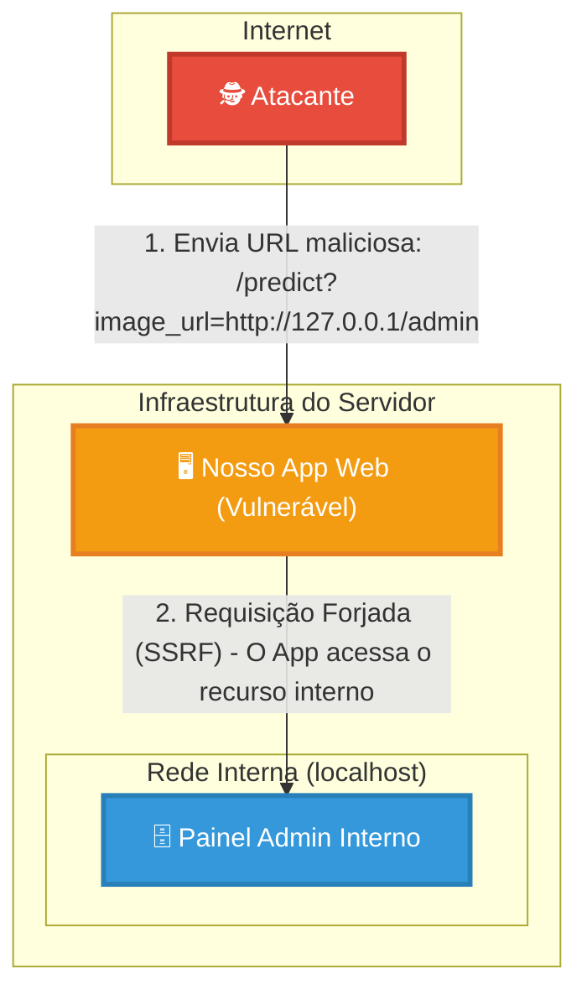
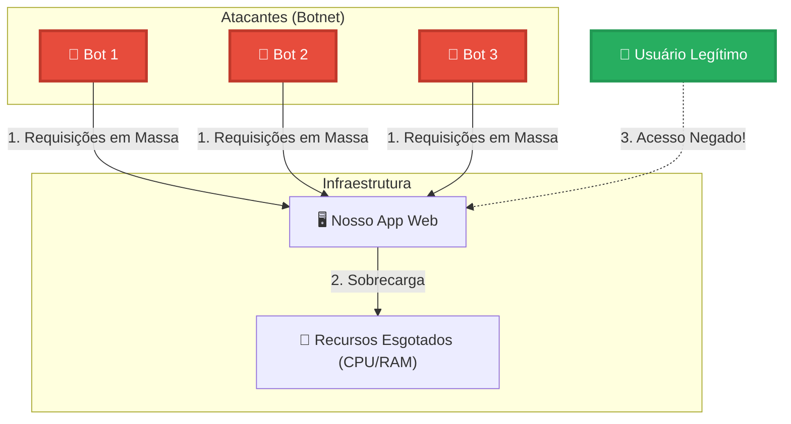
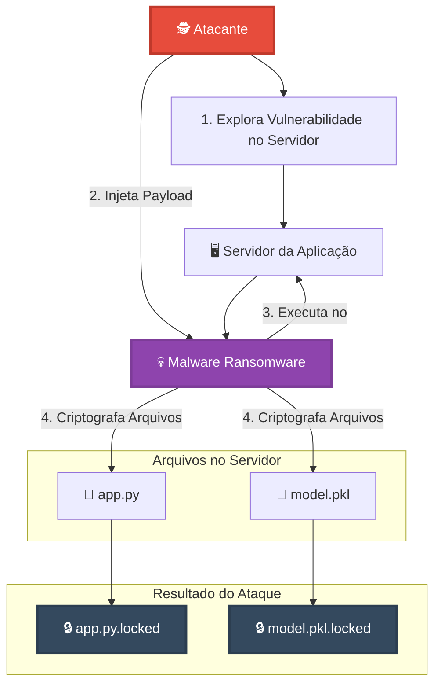
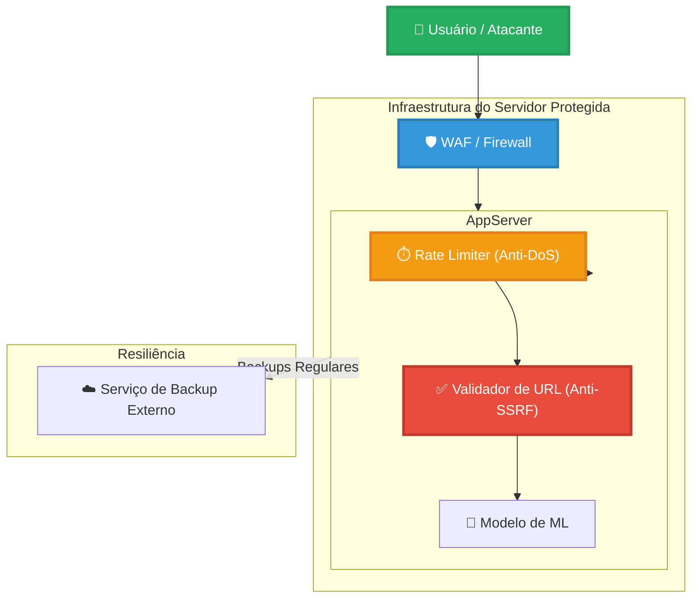

# Diagrama de Fluxo - Ataque SSRF (Server-Side Request Forgery)

## Vulnerabilidade Identificada
A aplicação Flask em `app.py` possui uma vulnerabilidade SSRF no endpoint `/predict` que aceita o parâmetro `image_url` sem validação adequada.

## Diagrama de Fluxo do Ataque



## Explicação do Ataque

1. **Atacante**: Envia uma requisição maliciosa para o endpoint `/predict` com uma URL interna como parâmetro
2. **Aplicação Web**: Processa a requisição sem validar se a URL é interna ou externa
3. **Painel Admin**: Recebe uma requisição que deveria ser bloqueada, mas é processada devido à vulnerabilidade SSRF

## Exemplo de Payload Malicioso
```
GET /predict?image_url=http://127.0.0.1:8080/admin
GET /predict?image_url=http://localhost:3306/mysql
GET /predict?image_url=file:///etc/passwd
```

## Mitigações Recomendadas
- Validar URLs permitidas (whitelist)
- Bloquear requisições para IPs internos
- Usar bibliotecas de validação de URL
- Implementar timeouts para requisições externas
- Monitorar logs de requisições suspeitas

---

# Diagrama de Fluxo - Ataque DoS (Denial of Service)

## Vulnerabilidade Identificada
A aplicação Flask pode ser sobrecarregada por múltiplas requisições simultâneas, causando esgotamento de recursos do servidor.

## Diagrama de Fluxo do Ataque DoS



## Explicação do Ataque DoS

1. **Botnet**: Múltiplos bots coordenados enviam requisições simultâneas
2. **Aplicação Web**: Tenta processar todas as requisições simultaneamente
3. **Recursos Esgotados**: CPU e RAM são sobrecarregados
4. **Usuário Legítimo**: Não consegue acessar o serviço devido à sobrecarga

## Exemplo de Ataque
- **Requisições simultâneas**: 1000+ requisições por segundo
- **Recursos afetados**: CPU 100%, RAM esgotada
- **Resultado**: Serviço indisponível para usuários legítimos

## Mitigações Recomendadas para DoS
- Implementar rate limiting (limite de requisições por IP)
- Usar CDN para distribuir carga
- Configurar load balancers
- Implementar cache para reduzir processamento
- Monitorar métricas de performance
- Configurar timeouts adequados
- Usar ferramentas de proteção como Cloudflare

---

# Diagrama de Fluxo - Ataque de Ransomware

## Vulnerabilidade Identificada
A aplicação Flask pode ser comprometida através de vulnerabilidades que permitem execução de código malicioso, resultando em criptografia de arquivos críticos.

## Diagrama de Fluxo do Ataque de Ransomware



## Explicação do Ataque de Ransomware

1. **Atacante**: Explora vulnerabilidades no servidor (SSRF, DoS, ou outras)
2. **Exploração**: Obtém acesso ao sistema através de falhas de segurança
3. **Injeção de Payload**: Instala malware ransomware no servidor
4. **Execução**: O ransomware executa no servidor comprometido
5. **Criptografia**: Arquivos críticos são criptografados e tornados inutilizáveis

## Arquivos Afetados na Aplicação
- **app.py**: Código principal da aplicação Flask
- **model.pkl**: Modelo de machine learning carregado pela aplicação
- **Outros arquivos**: Dados, logs, configurações

## Consequências do Ataque
- **Aplicação indisponível**: Arquivos criptografados impedem execução
- **Perda de dados**: Modelo de ML e código fonte inacessíveis
- **Paralisação do serviço**: Sistema completamente comprometido
- **Pedido de resgate**: Atacante exige pagamento para descriptografar

## Exemplo de Vulnerabilidades que Podem Ser Exploradas
- **SSRF**: Para acessar recursos internos
- **DoS**: Para sobrecarregar e criar brechas
- **Injeção de código**: Através de parâmetros não validados
- **Upload de arquivos**: Se a aplicação permitir uploads

## Mitigações Recomendadas para Ransomware
- **Backups regulares**: Manter cópias seguras dos arquivos críticos
- **Atualizações de segurança**: Manter sistema e dependências atualizadas
- **Antivírus/Antimalware**: Proteção em tempo real
- **Princípio do menor privilégio**: Limitar permissões de usuários
- **Monitoramento**: Detectar atividades suspeitas
- **Segmentação de rede**: Isolar sistemas críticos
- **Treinamento**: Educar usuários sobre phishing e ameaças
- **Plano de recuperação**: Procedimentos para restaurar após ataque

---

# Diagrama de Fluxo - Arquitetura Final Segura

## Arquitetura de Segurança Implementada
A aplicação agora possui múltiplas camadas de proteção contra os ataques identificados, formando uma arquitetura de segurança robusta.

## Diagrama de Fluxo da Arquitetura Segura



## Explicação da Arquitetura de Segurança

### 1. **WAF (Web Application Firewall) - Primeira Camada**
- **Função**: Filtro inicial de tráfego malicioso
- **Proteção**: Bloqueia ataques conhecidos antes de chegar à aplicação
- **Benefícios**: Reduz carga na aplicação e protege contra vulnerabilidades

### 2. **Rate Limiter (Anti-DoS) - Segunda Camada**
- **Implementação**: Flask-Limiter
- **Limite**: 10 requisições por minuto por IP
- **Proteção**: Previne sobrecarga do servidor
- **Resposta**: 429 Too Many Requests quando exceder limite

### 3. **Validador de URL (Anti-SSRF) - Terceira Camada**
- **Implementação**: Validação de domínios permitidos
- **Whitelist**: `i.imgur.com`, `images.pexels.com`
- **Proteção**: Bloqueia acesso a recursos internos
- **Resposta**: 403 Forbidden para URLs não permitidas

### 4. **Modelo de ML - Processamento Seguro**
- **Função**: Processamento de predições
- **Proteção**: Executado apenas após todas as validações
- **Carga**: Simulação com `time.sleep(0.5)`

### 5. **Serviço de Backup - Resiliência**
- **Função**: Backup regular dos arquivos críticos
- **Proteção**: Recuperação contra ataques de ransomware
- **Frequência**: Backups automáticos e regulares

## Fluxo de Segurança

1. **Usuário/Atacante** → Requisição para aplicação
2. **WAF** → Filtro inicial de segurança
3. **Rate Limiter** → Verificação de limite de requisições
4. **Validador de URL** → Validação de domínios permitidos
5. **Modelo de ML** → Processamento seguro da predição
6. **Backup Service** → Proteção contra ransomware

## Benefícios da Arquitetura

### **Defesa em Profundidade**
- Múltiplas camadas de proteção
- Falha de uma camada não compromete o sistema
- Redundância de segurança

### **Proteção Específica**
- **SSRF**: Validação de URLs + WAF
- **DoS**: Rate limiting + WAF
- **Ransomware**: Backups regulares + WAF

### **Monitoramento**
- Logs detalhados em cada camada
- Detecção de tentativas de ataque
- Métricas de performance e segurança

## Implementações Realizadas

### ✅ **Proteções Ativas**
- Rate limiting com Flask-Limiter
- Validação de domínios para SSRF
- Simulação de carga de trabalho
- Estrutura para backups

### 🔄 **Melhorias Futuras**
- Implementação de WAF real
- Sistema de backup automatizado
- Monitoramento avançado
- Alertas de segurança